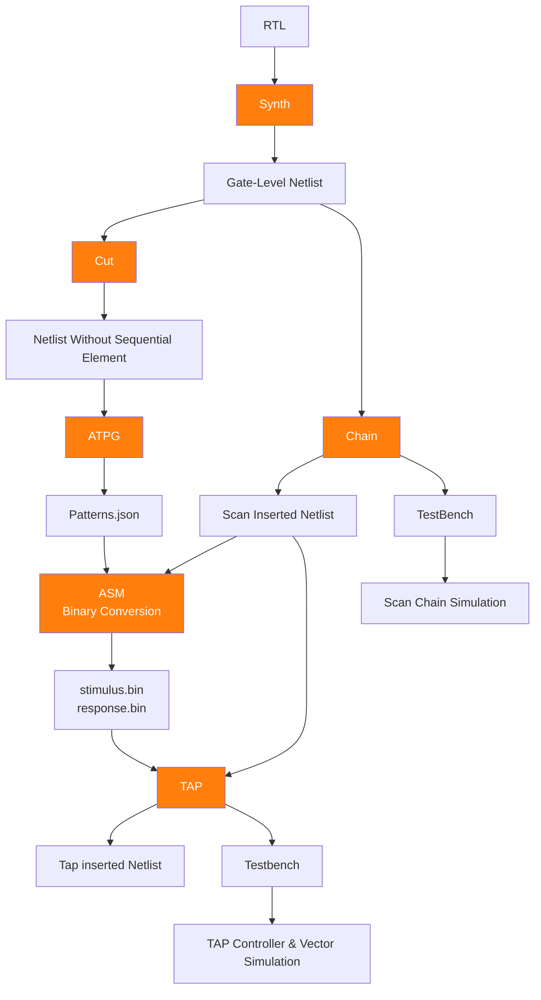
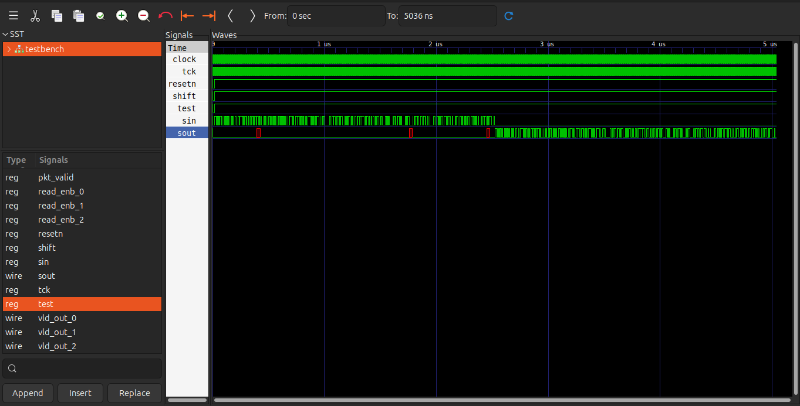

# Design for Testability (DFT)
Insert test structures into the synthesized design to improve controllability, observability, and manufacturing test coverage.

**Tools Required**
- [Fault](https://github.com/AUCOHL/Fault.git): DFT and ATPG framework 
- [yosys](https://github.com/YosysHQ/yosys.git): RTL synthesis to gate-level netlist 
- [Quaigh](https://github.com/Coloquinte/quaigh.git): (Optional but really recommended)Logic simplification and analysis tools
- [iverilog](https://github.com/steveicarus/iverilog.git): Verilog simulation and compilation  
- [gtkWAVE](https://github.com/gtkwave/gtkwave.git): Waveform visualization and debugging  
- [Quaigh](https://github.com/Coloquinte/quaigh.git): Logic simplification and analysis tools
 
 Before running DFT, prepare the SKY130 Verilog library model.

## DFT Flow Diagram

# Environment Setup
##  Activate Fault_Environment
Crucial: You must activate the environment in every new terminal session to link the hardware binaries and Python libraries.
```bash
source ~/fault_env/bin/activate && source $HOME/.cargo/env
```
What This Does:
- Activates Python virtual environment
- Loads Rust/Cargo tools (Required For Quaigh)
- Prepares system to run Fault flow

You can notice change in prompt
```bash
//Before
user@system:~

//After
(fault_env)-user@system:~
```

# Scan Chain Insertion

**Execute:**

```bash
cd DFT
fault chain \
--cell-model ../Tech_Lib/sky130_fd_sc_hd.v \
--liberty ../Tech_Lib/sky130_fd_sc_hd__tt_025C_1v80.lib \
--clock clock \
--reset resetn \
--reset-active-low \
--dff sky130_fd_sc_hd__dfxtp_1 \
-D FUNCTIONAL -D UNIT_DELAY= \
--output SCAN/router_top_scan_netlist.v \
../SYNTHESIS/Netlist/router_top_netlist.v \
2>&1 | tee LOGS/scan.log
```

**Internally Fault performs:**

- Read synthesized gate-level netlist
- Detect sequential elements (flip-flops)
- Add 2x1 Mux befor D flipflop
- Connect scan path across Design
- Insert scan control signals
- Generate updated scan netlist
- Generate Testbench for scan Chain validation
- Saves complete logs into LOGS/[scan.log](LOGS/scan.log)


## Expected Output
**SCAN/[router_top_scan_netlist.v](SCAN/router_top_scan_netlist.v)**: Scan inserted netlist.

This file contains:

- Original synthesized logic
- Inserted scan chain connections
- Scan control signals
- Updated flip-flop connections for test mode

**SCAN/[router_top_scan_netlist.v.tb.sv](SCAN/router_top_scan_netlist.v.tb.sv)**: Automatically generated verification testbench for scan chain validation. 


## Scan Chain Verification
 ```bash
 iverilog -D FUNCTIONAL -D UNIT_DELAY= -D VCD -o SIMULATION/chain_sim SCAN/router_top_scan_netlist.v.tb.sv
 cd SIMULATION
 vvp chain_sim
 ```
Expected Output
```bash
VCD info: dumpfile chain.vcd opened for output.
Success: expected <Binary String> got <Actual Binary String>
SUCCESS_STRING
SCAN/router_top_scan_netlist.v.tb.sv:82: $finish called at 5036000 (1ps)

```
Inspect Waveform

```bash
gtkwave chain.vcd
```


# Automatic Test Pattern Generation(ATPG)

## Step 1: CUT
All sequential elements (flip-flops) are removed and converted into observable and controllable interfaces.

This transforms the sequential design into a combinational representation, making fault generation easier.

```bash
fault cut \
--clock clock \
--reset resetn \
--dff sky130_fd_sc_hd__dfxtp_1 \
--output CUT/router_top_cut_netlist.v \
../SYNTHESIS/Netlist/router_top_netlist.v \
2>&1 | tee LOGS/cut.log

```
**Fault performs:**

- Read synthesized gate-level netlist
- Detect all flip-flops
- Remove sequential elements
- Convert flip-flop boundaries into ports
- Generate combinational CUT netlist
- Saves complete logs into LOGS/[cut.log](LOGS/cut.log)

**Expected Output**

**CUT/[router_top_cut_netlist.v](CUT/router_top_cut_netlist.v)**: Generated combinational CUT netlist.

**CUT Verification**

Before running ATPG, verify that the generated CUT netlist contains no sequential logic.
```bash
yosys -p " \
read_verilog CUT/router_top_cut_netlist.v; \
stat -liberty ../Tech_Lib/sky130_fd_sc_hd__tt_025C_1v80.lib" \
> REPORT/router_top_cut_area_report.rpt
```
Verify the following:

- No sequential cells are present
- No flip-flop cells (dfxtp, dfrtp, etc.) appear in cell statistics
- Sequential area should be 0%
- Port count should increase compared to synthesized netlist

Reason:

During CUT generation, all flip-flops are removed and replaced by additional input/output observation points.

## Step 2: Combinational ATPG
After generating the CUT netlist, perform Automatic Test Pattern Generation (ATPG).

This stage:

- Generates test vectors
- Simulates fault activation
- Measures fault coverage
- Compacts patterns
- Produces final ATPG coverage reports

```bash
fault atpg \
--cell-model ../Tech_Lib/sky130_fd_sc_hd.v \
--clock clock \
--reset resetn \
--reset-active-low \
--tv-count 1 \
--increment 1 \
--ceiling 10 \
--min-coverage 100 \
--output ATPG/router_top_pattern.json \
--output-coverage-metadata REPORT/metadata_report.yml \
CUT/router_top_cut_netlist.v \
2>&1 | tee LOGS/atpg.log

```

**Internally Fault performs:**

- Read CUT netlist
- Identify fault locations
- Generate random test vectors
- Simulate fault activation
- Measure coverage
- Add more vectors if needed
- Compact final patterns
- Saves complete logs into LOGS/[atpg.log](LOGS/atpg.log)

**Expected Output**

**ATPG/[router_top_pattern.json](ATPG/router_top_pattern.json)**: Generated ATPG Test Data.

**REPORT/[metadata_report.yml](REPORT/metadata_report.yml)**: ATPG coverage summary report.

Contains:

- Total fault sites
- Covered faults
- Uncovered faults
- Final fault coverage (%)

## Coverage Improvement

The test vectors could be simulated incrementally such that the size of the set is increased if sufficient coverage isn’t met. This is done by the following options:
```bash
fault atpg \
--cell-model ../Tech_Lib/sky130_fd_sc_hd.v \
--clock clock \
--reset resetn \
--reset-active-low \
--tv-count 10 \
--increment 10 \
--ceiling 6500 \
--min-coverage 100 \
--output ATPG/router_top_pattern.json \
--output-coverage-metadata REPORT/metadata_report.yml \
CUT/router_top_cut_netlist.v \
2>&1 | tee LOGS/atpg.log
```
- `--tv-count`: Number of the initially generated test vectors.

- `--min-coverage`: Minimum coverage percentage that should be met by the generated test vectors.

- `--increment`: Increment in the test vector count if minimum coverage isn’t met.

- `--ceiling`: Ceiling for the number of generated test vectors. If this number is reached, simulations are stopped regardless of the coverage.

**Expected Run Time** `~3hr to 4hr`

**Expected Coverage**: `~99.18%`

# Assemble test vectors
After generating ATPG patterns for targeted coverage, convert them into executable test vectors and expected outputs.

This step assembles:

- Generated ATPG patterns
- Scan inserted netlist
- Expected (golden) outputs

These files can later be used for validation and testing.

```bash
fault asm \
--output ASM/test_vector.bin \
--golden-output ASM/expected_output.bin \
ATPG/router_top_pattern.json \
SCAN/router_top_scan_netlist.v \
2>&1 | tee LOGS/asm.log
```
Fault performs:

- Read ATPG pattern(.JSON)
- Read scan inserted netlist
- Generate executable test vectors
- Export binary output files
- Saves complete logs into LOGS/[asm.log](LOGS/asm.log)

**Expected Output**

**ASM/[test_vector.bin](ASM/test_vector.bin)**: Binary file containing generated ATPG test vectors.

**ASM/[expected_output.bin](ASM/expected_output.bin)**: Golden reference output for pattern validation.

# JTAG TAP Insertion
After generating scan chains and ATPG vectors, insert a JTAG TAP (Test Access Port) into the design.

This stage integrates a standard JTAG interface to access the scan chain and execute generated test patterns.

This step:

- Inserts JTAG controller logic
- Connects TAP signals to scan chain
- Verifies TAP connectivity
- Validates generated test vectors

```bash
fault tap \
--cell-model ../Tech_Lib/sky130_fd_sc_hd.v \
--liberty ../Tech_Lib/sky130_fd_sc_hd__tt_025C_1v80.lib \
--clock clock \
--reset resetn \
--reset-active-low \
-D FUNCTIONAL -D UNIT_DELAY= \
--test-vectors ASM/test_vector.bin \
--golden-output ASM/expected_output.bin \
--output JTAG/router_top_jtag_netlist.v \
SCAN/router_top_scan_netlist.v \
2>&1 | tee LOGS/jtag.log
```
**Fault performs:**

- Read scan inserted netlist
- Insert TAP controller
- Connect JTAG interface
- Resynthesize updated design
- Verify TAP integrity
- Execute generated test vectors
- Validate outputs

**Expected terminal messages:**
```bash
Tap port verified successfully.
Test vectors verified successfully.
```

**Expected Output**

**JTAG/[router_top_jtag_netlist.v](JTAG/router_top_jtag_netlist.v)**: Final JTAG integrated gate-level netlist.

**JTAG/[router_top_jtag_netlist.v.tb.sv](JTAG/router_top_jtag_netlist.v.tb.sv)**: Auto-generated testbench for TAP verification.

**JTAG/[router_top_jtag_netlist.v.tv.tb.sv](JTAG/router_top_jtag_netlist.v.tv.tb.sv)**:Generated testbench for executing ATPG vectors.


 ## Test Vector & TAP Controller Verification

Run simulation to validate:

* JTAG TAP controller operation
* Generated ATPG test vectors
* Scan chain functionality

Execute:

```bash id="fyc7r9"
iverilog -D FUNCTIONAL -D UNIT_DELAY= -D VCD -o SIMULATION/vector_sim JTAG/router_top_jtag_netlist.v.tv.tb.sv

iverilog -D FUNCTIONAL -D UNIT_DELAY= -D VCD -o SIMULATION/tap_sim JTAG/router_top_jtag_netlist.v.tb.sv

cd SIMULATION

vvp vector_sim
vvp tap_sim
```

This verification confirms:

* TAP controller operates correctly
* Test vectors execute successfully
* Expected outputs are produced
* DFT insertion did not break functionality

---

## DFT Conclusion

At this stage, the design has been prepared for testing.

Completed steps:

* Scan chain insertion
* CUT generation
* ATPG pattern generation
* Test vector assembly
* JTAG TAP insertion
* Verification and validation

Generated outputs from this stage become inputs for the physical implementation stages of the RTL → GDSII flow.

Proceed to the next stage after successful DFT verification.
