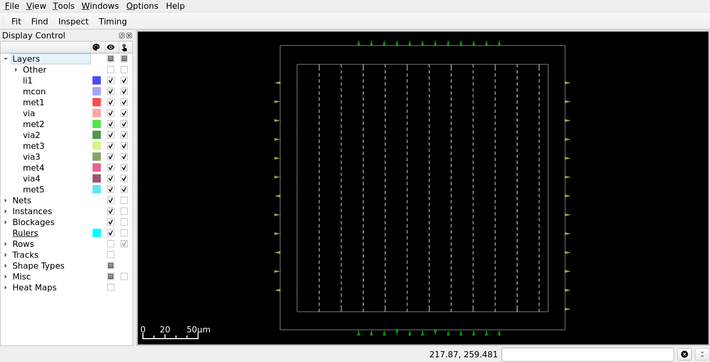
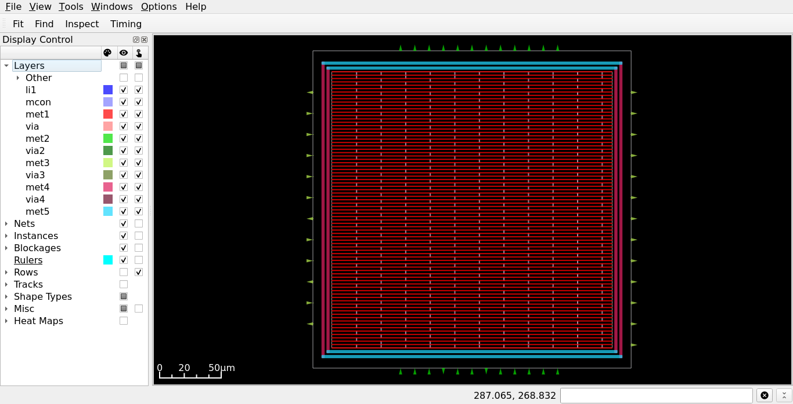
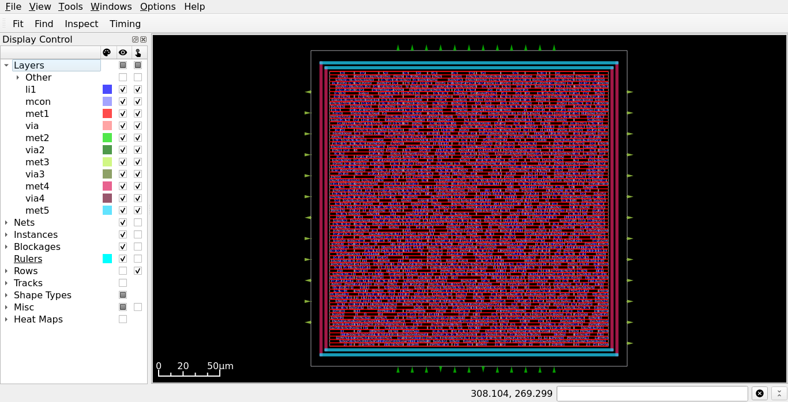
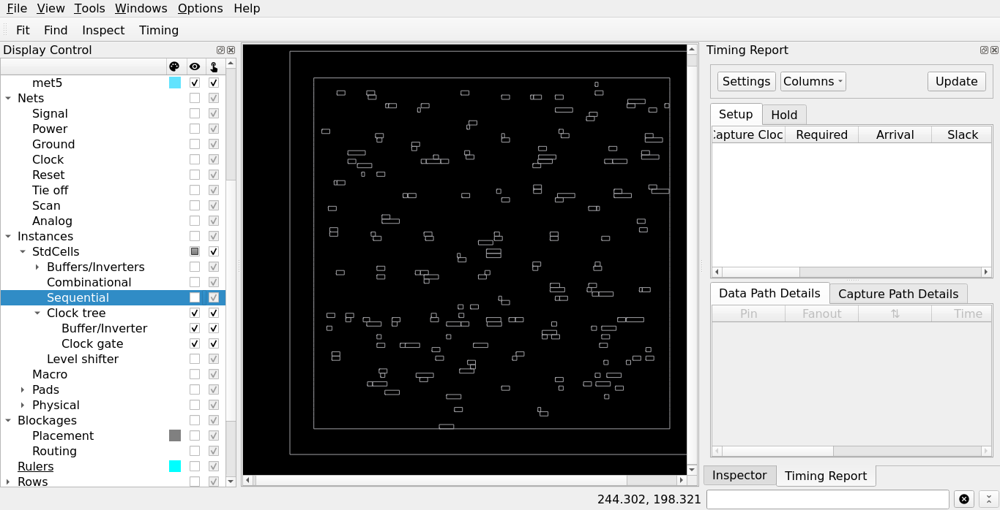
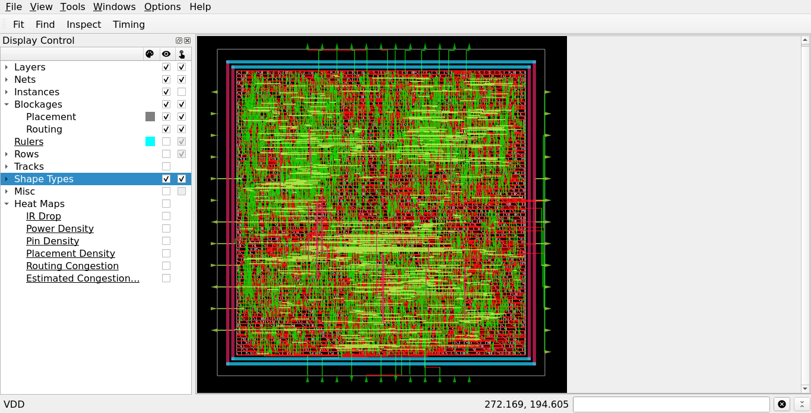

# PHYSICAL DESIGN

## Objective

Transform the timing-clean gate-level netlist into a manufacturable ASIC layout (GDSII) using the OpenROAD flow and the SKY130 open-source PDK.

During this stage, the design is physically implemented while satisfying timing, area, power, and design-rule constraints.


## Tool Used

Physical Design is performed using:

- [OpenROAD](https://github.com/The-OpenROAD-Project/OpenROAD.git): Physical design (PnR) and GDS generation  
- [klayout](https://github.com/KLayout/klayout.git): Layout viewing and verification 
- [Magic](https://github.com/RTimothyEdwards/magic.git): GDS Generation, DRC, LVS

Input files:

* Gate-level netlist (after DFT)
* Liberty timing library
* LEF technology and standard cell files
* Timing constraints (SDC)

Output:

* Placed and routed design
* Timing reports
* DEF database
* Extracted SPEF
* Final GDSII layout


## Physical Design Flow

The physical implementation is divided into the following stages:

1. Setup
2. Floorplan
3. Power Planning
4. Placement
5. Clock Tree Synthesis (CTS)
6. Routing
7. Final GDSII Generation

Each stage will be explained in detail in the following sections, including the required scripts, commands, generated reports, and methods for verifying successful completion.

# Launch OpenROAD

Before executing any Physical Design scripts, start the OpenROAD interactive shell.

Execute:

```bash
cd PD/SCRIPTS
openroad -log Log/pd.log
```
The `-log` option saves the complete OpenROAD session to `pd.log`, making it easier to review executed commands, warnings, and errors.

If OpenROAD is installed correctly, the terminal prompt will change to:

```text
OpenROAD>
```

This indicates that the OpenROAD shell is active and ready to accept Tcl commands.

All Physical Design scripts in this repository are executed from the `OpenROAD>` prompt using the `source` command.

Example:

```tcl
OpenROAD> source script.tcl
```

# Setup Design Database

The `0_Setup.tcl` script initializes the OpenROAD design database by loading all required technology and design files.

in `OpenROAD>` prompt, execute:

```tcl
source 0_Setup.tcl
```

### What this script does

The setup script performs the following tasks:

1. Loads the SKY130 Technology LEF containing routing layers, vias, and placement information.
2. Loads the Standard Cell LEF describing the physical abstracts of all standard cells.
3. Loads the SKY130 I/O LEF required for I/O cell support.
4. Loads the Liberty timing library for timing, area, and power characterization.
5. Reads the synthesized gate-level netlist generated after DFT/JTAG insertion.
6. Links the top-level design with the loaded standard cell library.
7. Applies the timing constraints from the SDC file.

After successful execution, the complete design database is available in memory, allowing the subsequent Physical Design stages such as Floorplanning, Power Planning, Placement, CTS, and Routing to be executed.

# Floor planning

The floorplanning stage defines the physical dimensions of the chip and prepares the design for placement. During this stage, the core area is created, routing tracks are generated, I/O pins are placed, and tap cells are inserted.

Execute the script from the `OpenROAD>` prompt:

```tcl
source 1_Floorplan.tcl
```

### What this script does

The floorplan script performs the following tasks:

1. Creates output directories for generated databases and reports.
2. Initializes the chip floorplan using the specified utilization, aspect ratio, and core margin.
3. Generates routing tracks for all SKY130 routing layers.
4. Reports the initial design area.
5. Assigns I/O pins to the top, bottom, left, and right edges of the chip.
6. Automatically places all I/O pins on the specified routing layers.
7. Inserts tap cells throughout the core to satisfy well connectivity requirements and prevent latch-up.
8. Saves the generated floorplan database for the next Physical Design stages.

### Expected Output

**RESULTS/FLOORPLAN/[Floorplan.db](RESULTS/FLOORPLAN/Floorplan.db)**

OpenROAD design database containing the initialized floorplan. It is used as the input for the subsequent Physical Design stages.

**RESULTS/FLOORPLAN/[Floorplan.def](RESULTS/FLOORPLAN/Floorplan.def)**

Design Exchange Format (DEF) file describing the physical floorplan, including:

* Die and core dimensions
* Standard-cell rows
* I/O pin locations
* Tap cell placement

This file can be opened in layout viewers such as KLayout or used by other EDA tools.

**RESULTS/FLOORPLAN/[Floorplan.odb](RESULTS/FLOORPLAN/Floorplan.odb)**

OpenDB database containing the complete floorplan information in OpenROAD's native format.

This database preserves:

* Floorplan geometry
* Routing tracks
* Pin locations
* Cell placement information

It is used by the remaining OpenROAD implementation stages without requiring the design to be reloaded.

### Visualize the Floorplan

After the floorplan is generated, launch the OpenROAD graphical interface to inspect the layout.

From the `OpenROAD>` prompt, execute:

```tcl
openroad> gui::show
```

The GUI displays the generated floorplan, allowing you to verify:

* Die and core boundaries
* I/O pin placement
* Standard-cell rows
* Tap cell insertion
* Routing tracks

# Power Planning

The power planning stage creates the Power Distribution Network (PDN) that delivers stable power and ground to every standard cell in the design. A well-designed PDN minimizes IR drop and ensures reliable chip operation.

Execute the script from the `OpenROAD>` prompt:

```tcl
source 2_Powerplan.tcl
```

### What this script does

The power planning script performs the following tasks:

1. Creates an output directory for the generated PDN database.
2. Defines global power (`VDD`) and ground (`VSS`) connections.
3. Connects all standard-cell power and ground pins to the corresponding global nets.
4. Defines the voltage domain for the design.
5. Creates the Power Distribution Network (PDN) grid.
6. Generates Metal1 follow-pin power rails for all standard-cell rows.
7. Creates Metal4/Metal5 power rings around the core.
8. Inserts Metal4 power stripes across the core for efficient power distribution.
9. Generates the complete PDN.
10. Saves the generated power plan database for the subsequent Physical Design stages.

### Expected Output

**RESULTS/PDN/[Powerplan.db](RESULTS/PDN/Powerplan.db)**

OpenROAD database containing the generated Power Distribution Network. This database is used as the input for the Placement stage.

**RESULTS/PDN/[Powerplan.def](RESULTS/PDN/Powerplan.def)**

DEF file describing the physical implementation after power planning, including:

* Power rings
* Power stripes
* Standard-cell power rails
* Updated floorplan information

**RESULTS/PDN/[Powerplan.odb](RESULTS/PDN/Powerplan.odb)**

OpenDB database containing the complete power network in OpenROAD's native format.

It preserves:

* Power rings
* Power stripes
* Follow-pin rails
* Global power connections
* Physical database for subsequent implementation stages

---

### Visualize the Power Plan

After the Power Distribution Network is generated, launch the OpenROAD graphical interface to inspect the layout.

From the `OpenROAD>` prompt, execute:

```tcl
gui::show
```

Verify that:

* Metal4/Metal5 power rings completely surround the core.
* Metal4 power stripes are uniformly distributed across the core.
* Metal1 follow-pin rails are generated for all standard-cell rows.
* The entire core is covered by the Power Distribution Network.
* No errors or warnings are reported during PDN generation.

Once the power network has been verified, proceed to the **Placement** stage.

# Placement

The placement stage determines the physical location of all standard cells within the floorplan while optimizing timing, wirelength, and congestion. The resulting placement serves as the foundation for Clock Tree Synthesis (CTS) and routing.

Execute the script from the `OpenROAD>` prompt:

```tcl
source 3_Placement.tcl
```

### What this script does

The placement script performs the following tasks:

1. Creates an output directory for the placement results.
2. Defines wire RC models for signal and clock nets.
3. Performs timing-driven global placement to optimize cell locations.
4. Legalizes the placement by removing overlaps and aligning cells to placement rows.
5. Verifies that the placement is free from legality violations.
6. Saves the placed design database for the CTS stage.

### Expected Output

**RESULTS/PLACEMENT/[Placement.db](RESULTS/PLACEMENT/Placement.db)**

OpenROAD database containing the legalized placement of all standard cells. This database is used as the input for the CTS stage.

**RESULTS/PLACEMENT/[Placement.def](RESULTS/PLACEMENT/Placement.def)**

DEF file describing the physical design after placement, including:

* Standard-cell locations
* I/O pin locations
* Floorplan information
* Power network
* Placement rows

**RESULTS/PLACEMENT/[Placement.odb](RESULTS/PLACEMENT/Placement.odb)**

OpenDB database containing the complete placed design in OpenROAD's native format.

It preserves:

* Standard-cell placement
* Power Distribution Network
* I/O pin placement
* Physical database for the CTS stage

### Visualize the Placement

After placement is completed, launch the OpenROAD graphical interface to inspect the design.

From the `OpenROAD>` prompt, execute:

```tcl
gui::show
```

Verify that:

* All standard cells are placed inside the core area.
* There are no overlapping cells.
* Cells are aligned with placement rows.
* The placement is evenly distributed without large empty regions.

Once the placement has been verified, proceed to the **Clock Tree Synthesis (CTS)** stage.

# Clock Tree Synthesis (CTS)

The Clock Tree Synthesis (CTS) stage constructs a balanced clock distribution network to deliver the clock signal from the clock source to every sequential element in the design. It minimizes clock skew, controls insertion delay, and repairs timing violations introduced by the clock network.

Execute the script from the `OpenROAD>` prompt:

```tcl
source 4_CTS.tcl
```

### What this script does

The CTS script performs the following tasks:

1. Creates directories for CTS and Static Timing Analysis (STA) reports.
2. Generates pre-CTS setup, hold, worst slack, and clock skew reports.
3. Builds the clock tree using SKY130 clock buffer cells.
4. Generates clock skew and CTS reports after clock tree insertion.
5. Legalizes the placement after inserting clock buffers.
6. Estimates wire parasitics for timing analysis.
7. Repairs hold and setup timing violations.
8. Performs a final legalization and parasitic estimation.
9. Generates post-CTS timing reports.
10. Saves the CTS database for the Routing stage.

### Expected Output


**REPORTS/STA/[Pre_cts](REPORTS/STA/Pre_cts/) Reports**

Timing reports generated before Clock Tree Synthesis. These provide a baseline for setup, hold, worst slack, and clock skew.

**REPORTS/STA/[Post_cts](REPORTS/STA/Post_cts/) Reports**

Timing reports generated after CTS and timing optimization. Compare these reports with the pre-CTS reports to observe improvements in clock skew and timing.

**REPORTS/CTS/[clock_skew_post_cts.rpt](REPORTS/CTS/clock_skew_post_cts.rpt)**

Contains the clock skew after clock tree construction. Lower skew indicates a more balanced clock network.

**RESULTS/CTS/[cts_final.db](RESULTS/CTS/cts_final.db)**

OpenROAD database containing the design after CTS and timing optimization. This database is used as the input for the Routing stage.

**RESULTS/CTS/[cts_final.def](RESULTS/CTS/cts_final.def)**

DEF file describing the physical design after clock tree insertion, including clock buffers and updated cell placement.

**RESULTS/CTS/[cts_final.sdc](RESULTS/CTS/cts_final.sdc)**

Updated timing constraints reflecting the CTS implementation. This file can be used for subsequent timing analysis.

**RESULTS/CTS[cts_final.odb](RESULTS/CTS/cts_final.odb)**

OpenDB database containing the complete post-CTS design in OpenROAD's native format.

## Visualize the CTS Result

After CTS is completed, launch the OpenROAD graphical interface to inspect the design.

From the `OpenROAD>` prompt, execute:

```tcl
gui::show
```

Verify that:

* Clock buffer cells have been inserted throughout the design.

Once the CTS results have been verified, proceed to the **Routing** stage.

# Routing

The Routing stage establishes the physical interconnections between all placed cells using the available metal layers. It performs global and detailed routing, repairs antenna violations, inserts filler cells, extracts parasitic RC values, and generates the final routed database along with post-route timing reports.

Execute the script from the `OpenROAD>` prompt:

```tcl
source 5_Routing.tcl
```

### What this script does

The routing script performs the following tasks:

1. Creates directories for routing reports, timing reports, and routing results.
2. Configures the routing layers for signal and clock nets.
3. Performs congestion-aware global routing.
4. Generates routing guides for the detailed router.
5. Performs detailed routing to create all physical metal connections.
6. Detects and repairs antenna violations.
7. Inserts filler cells to maintain continuous power rails.
8. Performs post-route Static Timing Analysis (STA).
9. Extracts parasitic resistance and capacitance (RC).
10. Generates the final routed netlist, SPEF, DEF, and OpenROAD databases.


### Expected Output

**global_route_congestion.rpt**

Reports routing congestion after global routing. Use this report to identify highly congested regions that may affect routability.

**detailed_route_drc.rpt**

Lists any Design Rule Check (DRC) violations remaining after detailed routing. Ideally, this report should contain **zero violations**.

**guide_coverage.rpt**

Shows how effectively the detailed router followed the routing guides generated during global routing.

**router.spef**

Standard Parasitic Exchange Format (SPEF) file containing the extracted resistance and capacitance of routed interconnects. It is used for accurate post-route timing analysis.

**router_top_post_route.v**

Final gate-level Verilog netlist after routing and filler cell insertion. This netlist represents the implementation-ready design.

**Post_Routing STA Reports**

These reports provide the final timing status of the routed design, including:

* Setup timing
* Hold timing
* Worst Negative Slack (WNS)
* Total Negative Slack (TNS)
* Clock skew

**Routing.def**

DEF file containing the fully routed physical design, including:

* Standard-cell placement
* Clock tree
* Signal routing
* Power network
* Metal interconnects

**Routing.odb**

OpenDB database containing the complete routed design. This database is typically used as the input for GDSII generation and final signoff.


### Visualize the Routed Design

After routing is completed, launch the OpenROAD graphical interface to inspect the routed design.

From the `OpenROAD>` prompt, execute:

```tcl
gui::show
```

Verify that:

* All signal nets are routed.
* The clock tree is fully routed across the design.
* Power rings and power stripes are connected.
* No unrouted nets remain.
* Antenna violations have been repaired.
* The DRC report contains zero (or minimal) violations.
* Post-route setup and hold timing meet the design constraints.

Once the routing results have been verified, the physical implementation is complete and the design is ready for **GDSII generation and final signoff**.

# GDS Generation

After completing routing, the final layout is exported in **GDSII** format using **Magic VLSI**.

The GDSII file contains the complete physical implementation of the design and serves as the final layout database for physical verification and fabrication.


### Run GDS Generation

Execute:

```bash
magic -dnull -noconsole \
-T ../Tech_Lib/sky130A.tech \
< GDS_Export.tcl \
2>&1 | tee Log/gds.log
```

This command:

- Launches Magic with the SKY130 technology
- Imports the routed DEF generated by OpenROAD
- Merges the standard-cell GDS library
- Generates the final GDSII layout

### Expected Output

- **RESULTS/GDS/[router_top.gds](RESULTS/GDS/router_top.gds)**

  Final GDSII layout containing the complete routed design. This file is used for DRC, LVS, and tape-out.

- **SCRIPTS/Log/[gds.log](SCRIPTS/Log/gds.log)**

  Execution log generated by Magic during GDS creation.

### Next Step

Once the GDSII file has been generated successfully, the design is ready for:

- Design Rule Check (DRC)

# Design Rule Check (DRC)

### What is DRC?

**Design Rule Check (DRC)** verifies that the final GDS layout satisfies all manufacturing rules defined by the SKY130 technology.

These rules are provided by the foundry to ensure that the fabricated chip can be manufactured reliably without defects.

Typical checks include:

- Minimum metal width
- Minimum spacing between wires
- Via enclosure rules
- Metal overlap requirements
- Well and implant spacing
- Poly spacing
- Contact enclosure
- Other process-specific design rules

Passing DRC indicates that the layout is physically manufacturable.

### Run DRC
Execute:

```bash
magic -dnull -noconsole \
-T ../../Tech_Lib/sky130A.tech \
< drc.tcl 
```

This command:

- Launches Magic in batch mode
- Loads the SKY130 technology file
- Imports the generated GDS layout
- Executes all DRC checks
- Generates a detailed DRC report
- Saves the execution log in **drc.log**

---

### What `drc.tcl` Does

The DRC script performs the following steps:

1. Loads the generated GDS layout.
2. Selects the top-level design.
3. Enables Euclidean distance checking for accurate rule verification.
4. Executes all SKY130 design rule checks.
5. Waits until every DRC operation is completed.
6. Prints the total number of violations.
7. Exports a detailed DRC report.
8. Exits Magic automatically.

### Expected Output

- **DRC/[router_top_drc.rpt](REPORTS/DRC/router_top_drc.rpt)**

  Detailed report containing all DRC violations detected in the layout.


### Understanding the DRC Report

If the design passes DRC successfully, the report should contain:

```text
No DRC violations found.
```

or the summary should report:

```text
Total DRC errors: 0
```

If violations are present, the report lists each violation with its corresponding design rule and location in the layout.

Example:

```text
Metal1 spacing violation
Contact enclosure violation
Via overlap violation
```

Each reported violation should be reviewed and corrected before proceeding to fabrication.

### Verification Checklist

Before proceeding to LVS:

- Successfully generated **router_top.gds**
- DRC completed without runtime errors
- DRC report generated successfully
- Total DRC violations are zero
- Layout is ready for electrical verification (LVS)

The next step is **Layout Versus Schematic (LVS)**, where the physical layout is compared against the post-route gate-level netlist to verify electrical equivalence.
