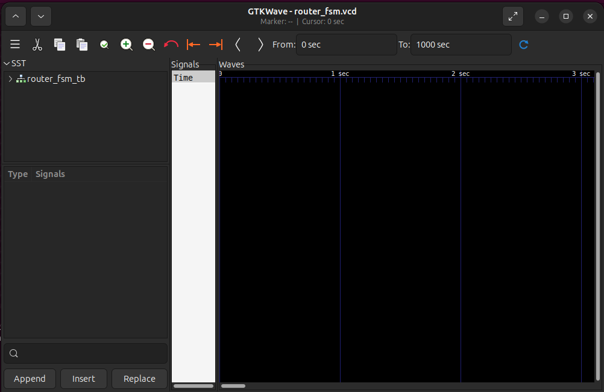
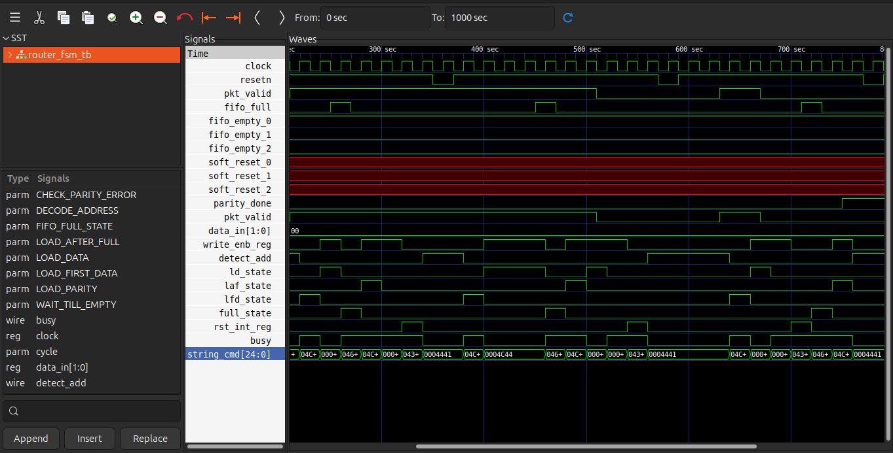

# Simulation

## Objective

Verify that the provided RTL behaves according to the design specification before proceeding to synthesis.

Simulation is performed using:

- [iverilog](https://github.com/steveicarus/iverilog.git): Verilog simulation and compilation  
- [gtkWAVE](https://github.com/gtkwave/gtkwave.git): Waveform visualization and debugging 


## Compile RTL and Testbench
Compile the testbench.

```bash
cd ~/RTL-TO-GDSII/Simulation
iverilog -o fsm_sim.out ../Testbench/router_fsm_tb.v
```
This repository already includes RTL source files inside the testbench using Verilog include statements.

If your testbench does not include RTL files internally, compile by passing RTL files explicitly:

```bash
iverilog -o fsm_sim.out ../RTL/router_fsm.v ../Testbench/router_fsm_tb.v
```

Expected output: Simulation/[fsm_sim.out](fsm_sim.out)

## Run Simulation
Execute the compiled simulation.

```bash
vvp fsm_sim.out
```

Expected output
```bash
VCD info: dumpfile router_fsm.vcd opened for output.
Reset=x, State=    , det_add=x, write_enb_reg=x, full_state=x, lfd_state=x, busy=x, ld_state=x, laf_state=x, rst_int_reg=x, low_packet_valid=x
Reset=0, State=    , det_add=x, write_enb_reg=x, full_state=x, lfd_state=x, busy=x, ld_state=x, laf_state=x, rst_int_reg=x, low_packet_valid=x
.
.
.
Reset=0, State=  DA, det_add=1, write_enb_reg=0, full_state=0, lfd_state=0, busy=0, ld_state=0, laf_state=0, rst_int_reg=0, low_packet_valid=0
Reset=1, State=  DA, det_add=1, write_enb_reg=0, full_state=0, lfd_state=0, busy=0, ld_state=0, laf_state=0, rst_int_reg=0, low_packet_valid=0
../Testbench/router_fsm_tb.v:197: $finish called at 1000 (1s)

```
If the waveform file([*.vcd](router_fsm.vcd)) is not generated, verify that `$dumpfile` and `$dumpvars` are present in the testbench.

## Inspect Waveform
Open the generated waveform using GTKWave.
```bash
gtkwave router_fsm.vcd
```
Expected output:



Analyze Signals inside GTKWave:

Expand the module hierarchy panel
Select required signals
Click Insert to add signals to waveform view
Zoom in / zoom out as needed
Observe signal transitions and timing behavior



## Repeat for All Modules

Perform simulation and waveform verification for each module individually before verifying the complete top-level design.

router_fifo → router_fsm → router_reg → router_sync → router_top

---

# **Proceed to the next stage only after all individual modules and the top-level design pass simulation.**